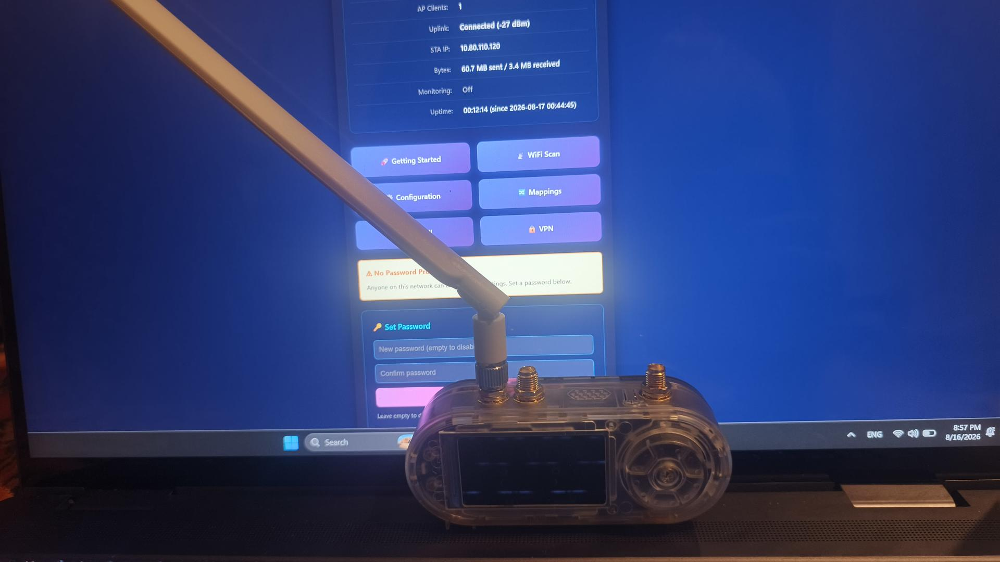
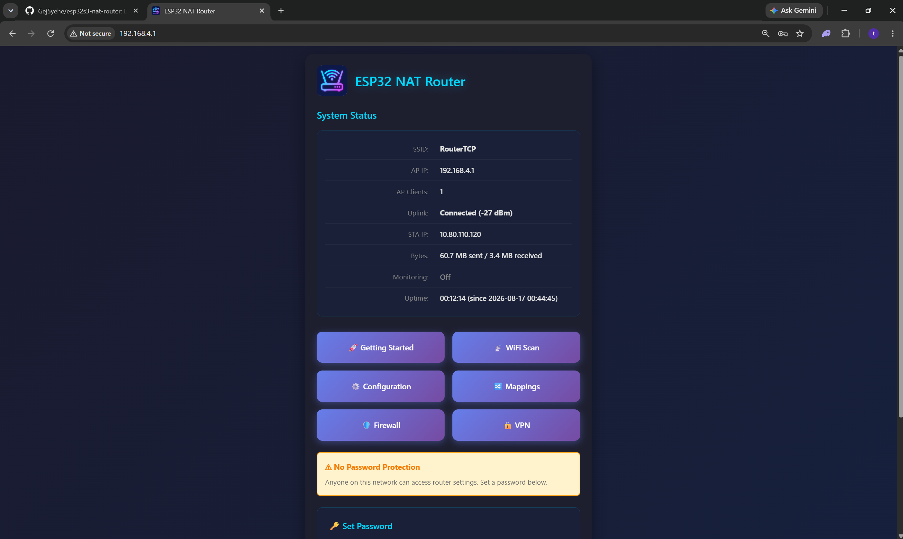
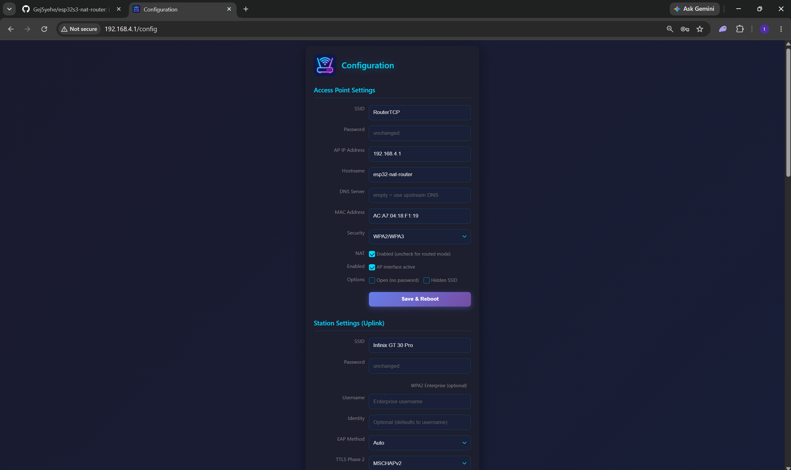
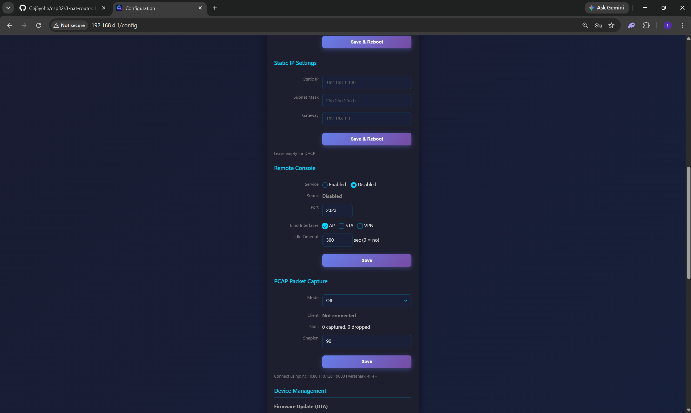
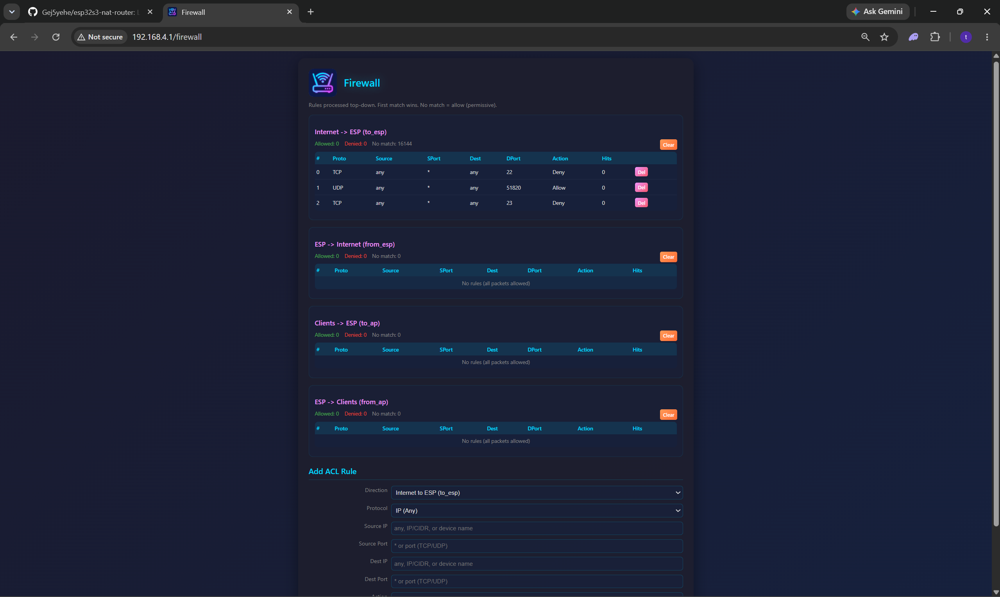
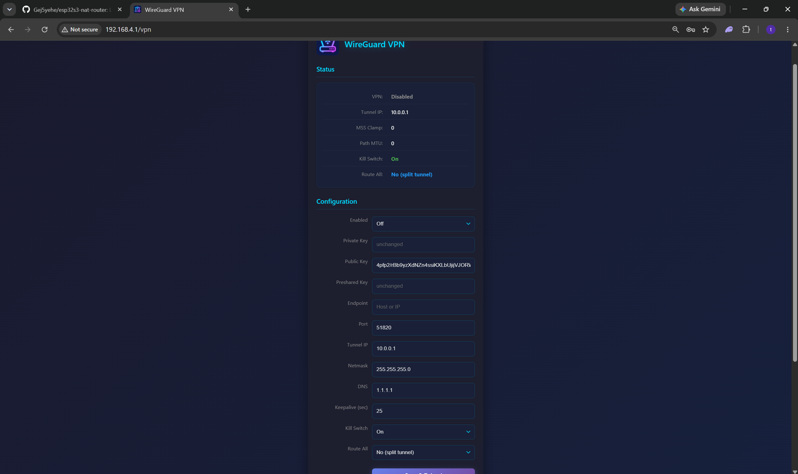
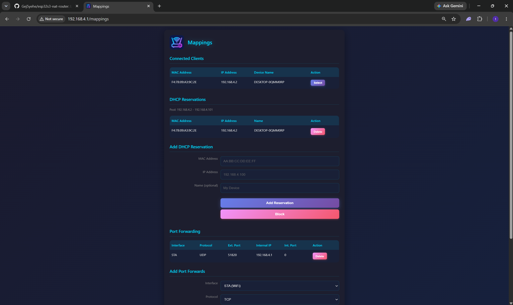

# 🛰️ ESP32-S3 NAT Router — LilyGo CC1101 Plus

> **Full setup**: Flashing `esp_nat_router` firmware on a **LilyGo T3S3 CC1101 Plus (ESP32-S3)**, configured with WireGuard VPN, firewall ACL rules, port forwarding, and DHCP reservations.

<p align="center">
  
</p>

<p align="center">
  
  
  
  
  
</p>

---

## 📋 Table of Contents

1. [Hardware Overview](#hardware-overview)
2. [Prerequisites](#prerequisites)
3. [Flashing esp_nat_router](#flashing-esp_nat_router)
4. [System Status](#system-status)
5. [Configuration](#configuration)
6. [Firewall Setup](#firewall-setup)
7. [WireGuard VPN](#wireguard-vpn)
8. [Mappings & Port Forwarding](#mappings--port-forwarding)
9. [Network Topology](#network-topology)
10. [Troubleshooting](#troubleshooting)

---

## 🔩 Hardware Overview

| Component | Details |
|-----------|---------|
| **Board** | LilyGo T3S3 CC1101 Plus |
| **Chip** | ESP32-S3 (Xtensa LX7 dual-core, 240 MHz) |
| **Flash** | 16 MB |
| **PSRAM** | 8 MB (QSPI) |
| **RF Module** | CC1101 (Sub-GHz 315/433/868/915 MHz) |
| **USB** | USB-C (native USB, JTAG capable) |
| **Wi-Fi** | 802.11 b/g/n 2.4 GHz + BLE 5.0 |

---

## ⚙️ Prerequisites

```bash
# Install esptool
pip install esptool pyserial

# Clone esp_nat_router firmware
git clone https://github.com/jonask24/esp_nat_router.git
cd esp_nat_router

# Install ESP-IDF (v5.x)
git clone --recursive https://github.com/espressif/esp-idf.git
cd esp-idf && ./install.sh esp32s3 && source ./export.sh
```

---

## ⚡ Flashing esp_nat_router

### Step 1 — Enter Boot Mode

Hold **BOOT** on the LilyGo board while plugging in USB-C. Release after device is detected.

```bash
# Verify chip detection
esptool.py --port COM3 chip_id
# Expected: Chip is ESP32-S3(revision v0.2)
```

### Step 2 — Erase & Flash

```bash
# Erase flash
esptool.py --chip esp32s3 --port COM3 erase_flash

# Build firmware
cd esp_nat_router
idf.py set-target esp32s3
idf.py build

# Flash
esptool.py --chip esp32s3 --port COM3 --baud 921600 \
  write_flash -z --flash_mode dio --flash_freq 80m --flash_size 16MB \
  0x0     build/bootloader/bootloader.bin \
  0x8000  build/partition_table/partition-table.bin \
  0x10000 build/esp_nat_router.bin
```

> See [`scripts/flash.sh`](scripts/flash.sh) for the automated flash script.

---

## 📡 System Status

After flashing and connecting the ESP32-S3 to upstream Wi-Fi, the System Status page confirms the device is online:

<p align="center">
  
</p>

| Field | Value |
|-------|-------|
| **SSID (AP)** | RouterTCP |
| **AP IP** | 192.168.4.1 |
| **Uplink** | Connected (-26 dBm) |
| **STA IP** | 10.80.110.120 (from upstream router) |
| **Hostname** | esp32-nat-router |

---

## ⚙️ Configuration

The Configuration page sets up the Access Point (AP) and Station (uplink) interfaces:

<p align="center">
  
</p>

<p align="center">
  
</p>

**Access Point Settings:**

| Setting | Value |
|---------|-------|
| SSID | `RouterTCP` |
| AP IP | `192.168.4.1` |
| Hostname | `esp32-nat-router` |
| MAC Address | `AC:A7:04:18:F1:19` |
| Security | WPA2/WPA3 |
| NAT | Enabled |

---

## 🔥 Firewall Setup

ACL rules configured via the built-in Firewall page at `http://192.168.4.1/firewall`:

<p align="center">
  
</p>

**Active Rules (Internet → ESP):**

| # | Proto | Source | Dest Port | Action |
|---|-------|--------|-----------|--------|
| 0 | TCP | any | 22 | **Deny** — Block SSH from WAN |
| 1 | UDP | any | 51820 | **Allow** — WireGuard VPN |
| 2 | TCP | any | 23 | **Deny** — Block Telnet |

> Default policy: permissive (explicit deny rules above override). See [`firewall/firewall_rules.conf`](firewall/firewall_rules.conf) for the full documented ruleset.

---

## 🔐 WireGuard VPN

WireGuard is configured directly on the ESP32-S3 via `http://192.168.4.1/vpn`:

<p align="center">
  
</p>

**Interface Configuration:**

| Setting | Value |
|---------|-------|
| Tunnel IP | `10.0.0.1` |
| Listen Port | `51820` |
| DNS | `1.1.1.1` |
| Keepalive | `25 sec` |
| Kill Switch | On |
| Route All | No (split tunnel) |

**Key generation:**
```bash
# Generate ESP32 private key
python -c "import os,base64; print(base64.b64encode(os.urandom(32)).decode())"

# Or use the setup script:
bash scripts/setup_wireguard.sh
```

> See [`vpn/wg0.conf`](vpn/wg0.conf) for the full WireGuard configuration template.

---

## 🔀 Mappings & Port Forwarding

DHCP reservations and port forwarding configured at `http://192.168.4.1/mappings`:

<p align="center">
  
</p>

**DHCP Reservations:**

| MAC Address | IP Address | Device |
|-------------|------------|--------|
| F4:7B:09:A5:9C:2E | 192.168.4.2 | DESKTOP-0QMM0RP |

**Port Forwarding:**

| Interface | Protocol | Ext. Port | Internal IP | Int. Port |
|-----------|----------|-----------|-------------|-----------|
| STA | UDP | 51820 | 192.168.4.1 | 51820 (WireGuard) |

---

## 🗺️ Network Topology

```
                    ┌─────────────────────────────┐
                    │         INTERNET             │
                    └──────────────┬───────────────┘
                                   │
                    ┌──────────────▼───────────────┐
                    │     Upstream Router           │
                    │     (Infinix GT 30 Pro)       │
                    │     STA → 10.80.110.120       │
                    └──────────────┬───────────────┘
                                   │ Wi-Fi STA
                    ┌──────────────▼───────────────┐
                    │   LilyGo CC1101 Plus          │
                    │   ESP32-S3 NAT Router         │
                    │   AP IP: 192.168.4.1          │
                    │   WireGuard: 10.0.0.1:51820   │
                    │   Firewall: ACL rules active  │
                    └──────────────┬───────────────┘
                                   │ Wi-Fi AP
               ┌───────────────────┼───────────────┐
               │                   │               │
  ┌────────────▼──┐    ┌───────────▼───┐   ┌──────▼───────┐
  │ DESKTOP-0QMM  │    │   Phone       │   │  Other Device │
  │ 192.168.4.2   │    │ 192.168.4.3   │   │ 192.168.4.x   │
  └───────────────┘    └───────────────┘   └───────────────┘
```

---

## 🔧 Troubleshooting

### Device Not Detected
```powershell
# Windows — check COM ports
Get-WmiObject Win32_PnPEntity | Where-Object {$_.Name -like "*COM*"}
```

### Flash Fails
```bash
esptool.py --baud 115200 --no-stub --chip esp32s3 --port COM3 write_flash ...
```

### Wi-Fi Won't Connect
- Upstream must be **2.4 GHz** (ESP32-S3 has no 5 GHz support)
- Check SSID/password at `http://192.168.4.1/config`

### WireGuard Not Connecting
- Verify UDP 51820 is allowed in firewall (Rule #1 ✅)
- Port forward UDP 51820 → 192.168.4.1 is set (Mappings ✅)
- Check peer public key matches on both ends

---

## 📚 References

- [esp_nat_router](https://github.com/jonask24/esp_nat_router)
- [ESP32-S3 Datasheet](https://www.espressif.com/sites/default/files/documentation/esp32-s3_datasheet_en.pdf)
- [LilyGo T3S3 Hardware](https://github.com/Xinyuan-LilyGO/LilyGo-LoRa-Series)
- [WireGuard Protocol](https://www.wireguard.com/protocol/)
- [esptool.py](https://docs.espressif.com/projects/esptool/en/latest/)

---

## 📄 License

MIT License — free to use, modify, and share.

---

<p align="center">Made with ❤️ by <b>Gej5yehe</b> — ESP32-S3 NAT Router Project</p>
